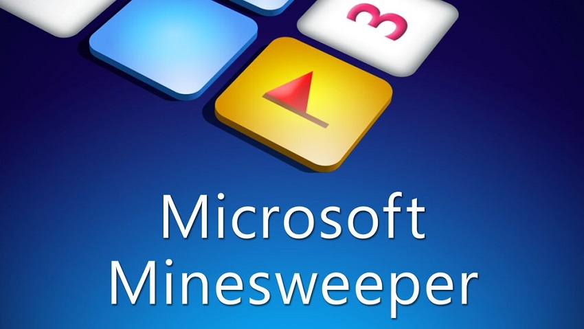

# *Minesweeper* Cheat


[](https://www.microsoft.com/en-ie/windows)


## Introduction



A game cheat for *Microsoft Minesweeper*. It will change the window title to "*Mlnesweeper*" if the current block has a mine.

## Getting Started

### Prerequisites

- Install [*MASM32*](http://www.masm32.com).
- Set the `PATH` environment variable.

### Building

Run the `build.ps1` file directly:

```console
PS> .\build.ps1
```

The `cheat.dll` will be generated in the `bin` folder.

### Usage

> The project has been only tested with the provided game version.
>
> The *MD5* of `Minesweeper.exe` is `9C45D38B74634C9DED60BEC640C5C3CA`.

The `cheat.dll` must be injected into the game to activate its function. You can directly use this simple injection tool: [*Dll-Injector*](https://github.com/Zhuagenborn/Windows-DLL-Injector).

```console
Dll-Injector Minesweeper cheat.dll
```

The window title will become "*Mlnesweeper*" if the current block has a mine.


## Reverse Engineering

### Graphic

*Microsoft Minesweeper* uses the `BitBlt` function to draw its mine area.


`0x01005334` and `0x01005338` are the addresses of the mine area's width and height. When the game executes at `0x01002700` for the first time, the mine area is empty.


The stack is shown as below:


According to the declaration of `BitBlt`, the pixel coordinate of the *top-left* corner of the mine area is *(12, 55)*. And the side length of a block is *16*.

```c
BOOL BitBlt(HDC hdc, int x, int y, int cx, int cy, HDC hdcSrc, int x1, int y1, DWORD rop);
```

### Mine Data

At `0x01002669`, the game reads mine data from `0x01005340`.


For the following mine area:


The data around `0x01005340` are organized as:


It is clear that each `0x8A` means a mine and `0xCC` is the activated mine.

## License

Distributed under the *MIT License*. See `LICENSE` for more information.